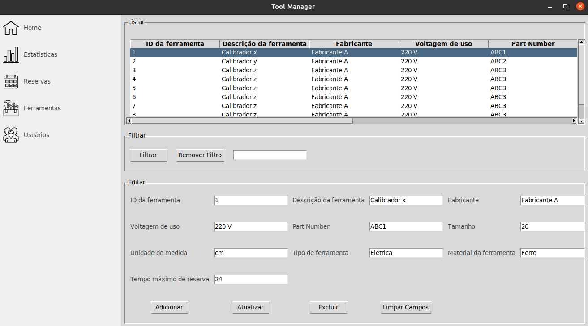
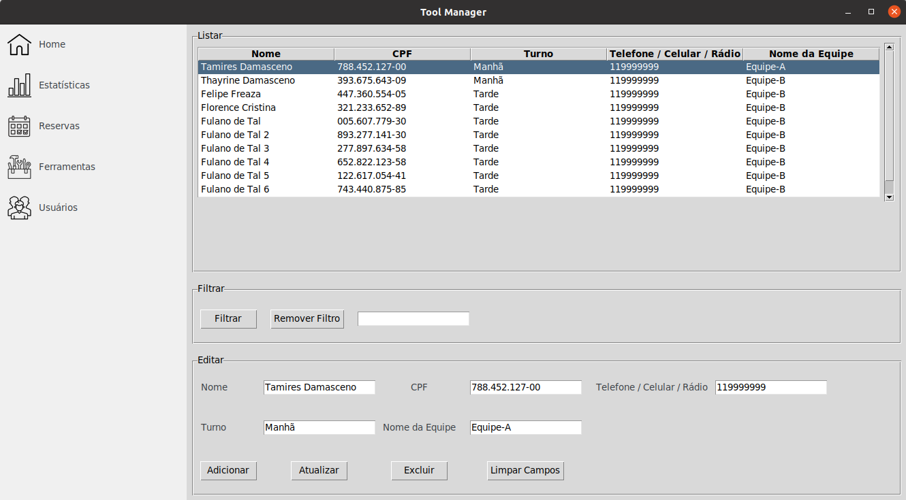

# Projetando Uma Aplicação Desktop

**Curso:** Desenvolvimento Full-Stack

**Mundo:** 1

**Turma:** 22.2

**Semestre:** 1º 

**Grupo:** Dev team 8

**Integrantes**
- [Tamires Damasceno Rodrigues (Matrícula 202205214702)](https://www.linkedin.com/in/tamiresdr/)
- [Thayrine Damasceno Rodrigues (Matrícula 202205214771)](https://www.linkedin.com/in/thayrinedr/)
- Felipe Freaza Fidalgo (Matrícula 202205014495)
- Florence Cristina Gonçalves (Matrícula 202205236005)

Apresentação em Vídeo: https://www.youtube.com/watch?v=7r5FQ05FICY

---

## Índice
[1 Introdução](#1-introdução)

[2 Requisitos Funcionais](#2-requisitos-funcionais)

[3 Requisitos Não Funcionais](#3-requisitos-não-funcionais)

[4 Guia de Desenvolvimento](#4-guia-de-desenvolvimento)

[5 Dados de Teste](#5-dados-de-teste)

## 1 Introdução
Este projeto, **Projetando Uma Aplicação Desktop**, foi desenvolvido em grupo como requisito da Missão Certificação com o objetivo de verificar se os estudantes (jogadores) conquistaram as competências e habilidades necessárias do mundo vigente (1º mundo do curso), neste caso, a certificação de **Programador Raiz**, um profissional especialista em linguagem Python.

O principal objetivo do desafio proposto é desenvolver uma aplicação desktop em Python para gestão das ferramentas utilizadas por técnicos durante a manutenção em um ambiente de produção de conteúdo audiovisual de grande porte, que possui muitas instalações e equipamentos com diversas necessidades de manutenção preventiva e corretiva recorrentes. Sendo que existem várias equipes de manutenção, separadas por turnos, que trabalham nos mesmos equipamentos e instalações.

À esse sistema atribuímos o nome **Tool Manager** e ele está em sua primeira versão. Investimos bastante tempo na configuração do projeto com as melhores práticas do mundo de desenvolvimento de Software, mas entendemos que ainda temos muito trabalho pela frente. Seguiremos aperfeiçoando este sistema e liberando novas versões. A ideia é utilizar este projeto como ferramenta de estudo contínua. Já temos em vista, por exemplo, a inclusão de testes automatizados para aumentar a segurança e integridade do código.

## 2 Requisitos Funcionais

### 2.1 Cadastro de Ferramentas
Cada ferramenta precisa ter um tempo máximo permitido para sua reserva (horas, dias
etc.), auxiliando o responsável pela Central de Ferramentaria no combate ao uso
inadequado das ferramentas. Cada ferramenta deve ter as seguintes informações
associadas a ela:

- **ID da ferramenta**: código interno, gerado automaticamente pelo sistema. Cada
ferramenta possui um único código de identificação (numérico);

- **Descrição da ferramenta**: texto livre contendo as principais informações de
identificação (60 caracteres);

- **Fabricante**: texto livre (30 caracteres);

- **Voltagem de uso**: texto livre (15 caracteres);

- **Part Number**: número que identifica a ferramenta no fabricante (25 caracteres);

- **Tamanho**: informação em número (20 caracteres);

- **Unidade de medida**: cm, polegadas, metros etc. (15 caracteres);

- **Tipo de ferramenta**: elétrica, mecânica, segurança etc. (15 caracteres);

- **Material da ferramenta**: ferro, madeira, borracha, plástico etc. (15 caracteres);

- **Tempo máximo de reserva**: em horas - numérico.



### 2.2 Cadastro dos Técnicos Responsáveis
Todos os técnicos precisam estar cadastrados no sistema, pois eles precisarão ser
facilmente identificados e contatados em caso de atraso na devolução da ferramenta. Cada
técnico deve ter as seguintes informações associados a ele:

- **CPF**: deve ter o digito verificador validado;

- **Nome Completo**: texto livre (40 caracteres);

- **Telefone celular ou rádio**: 9 dígitos para celular ou até 8 dígitos para rádio;

- **Turno**: manhã, tarde ou noite;

- **Nome da equipe**: texto livre (30 caracteres).



### 2.3 Reserva de Ferramentas
As solicitações de reservas precisam ser enviadas por e-mail para o responsável pela
Central de Ferramentaria, indicando:

- **Código da ferramenta**: XXXX (ID - cada ferramenta deve possuir um código único);

- **Descrição da solicitação**: XXXX;

- **Data e hora da retirada**: XXXX;

- **Data e hora prevista de devolução**: XXXX;

- **Técnico responsável pela retirada**: XXXX (nome completo).

### 2.4 Atualização, filtragem e exclusão
Tanto os técnicos quanto as ferramentas podem ser filtradas, atualizadas e excluídas do cadastro quando necessário.

## 3 Requisitos Não Funcionais

### 3.1 Linguagem
- Python

### 3.2 Framework
- Tkinter

### 3.3 Banco de Dados
- SQLite

## 4 Guia de Desenvolvimento

### 4.1 Download do projeto

Faça o download deste repositório ou clone via SSH, como descrito abaixo.

Configure uma chave SSH para sua conta no GitHub:

https://docs.github.com/en/authentication/connecting-to-github-with-ssh/adding-a-new-ssh-key-to-your-github-account

Clone o repositório do GitHub para sua máquina:
```
$ git clone git@github.com:tamiresdr/tool-manager.git
```

### 4.3 Dependências
- Python >= 3.10
- Poetry (`$ pip install poetry`)
- Git

### 4.4 Como utilizar?
\* Garanta que todas as dependências listadas na seção [Dependências](#43-dependências) estão instaladas corretamente.

Copie o arquivo `env-example` para seu `.env`:
```
$ cp env-example .env
```

Prepare seu ambiente de desenvolvimento:
```
$ make init-dev
```

Crie as tabelas no banco de dados:
```
$ make migrate
```

Agora rode a aplicação e "corra para o abraço":
```
$ make run
```

### 4.5 Garanta um código limpo e padronizado
Formate o código automaticamente:
```
$ make lint
```

Cheque se o código está seguindo as boas práticas:
```
$ make lint-check
```

### 4.6 Testes automatizados
(em desenvolvimento)

## 5 Dados de Teste
Para simplificar o teste do sistema este repositório possui um banco de dados pré-populado com dados fictícios - `tool-manager.db`.
